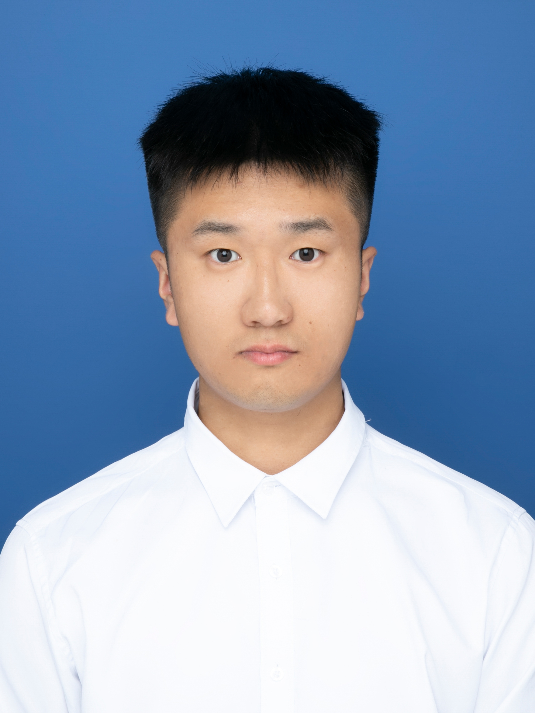

  

    
    

      
<strong>🎓 Ruifeng Han</strong>

      
Artificial Intelligence

      
Nanjing University of Information Science and Technology

      

      
📧 <a href="mailto:202312620009@nuist.edu.cn">202312620009@nuist.edu.cn</a>

      
💻 <a href="https://github.com/MapleMemories">github.com/MapleMemories</a>

      

      
<strong>🔬 Research</strong> Robot Visual Perception Computer Vision Point Cloud Segmentation

    

  

  <h1 style="margin-top: 0;">Hi there! 👋 I'm Ruifeng Han</h1>
  
Welcome to my GitHub homepage! I'm a Master's Candidate in Artificial Intelligence at Nanjing University of Information Science and Technology (NUIST), passionate about advancing research in computer vision and 3D data processing.

  <h2>About Me</h2>
  <ul>
    <li>🎓 <strong>Current Status</strong>: Master's Candidate (2023 - Present) at NUIST, Nanjing, China</li>
    <li>🔬 <strong>Research Focus</strong>: Deep learning, Computer Vision, Point cloud segmentation, Multi-modal fusion algorithms</li>
  </ul>

  <h2>Education</h2>
  <table>
    <tr>
      <th>Education</th>
      <th>Institution</th>
      <th>Major</th>
      <th>Year</th>
    </tr>
    <tr>
      <td>Master's</td>
      <td>Nanjing University of Information Science and Technology</td>
      <td>Artificial Intelligence</td>
      <td>2023 - Present</td>
    </tr>
    <tr>
      <td>Bachelor's</td>
      <td>Taizhou Institute of Sci.& Tech.NJUST</td>
      <td>Computer Science and Technology</td>
      <td>2019 - 2023</td>
    </tr>
  </table>

  <h2>Research Interests</h2>
  <ul>
    <li>Robot Visual Perception</li>
    <li>Computer Vision</li>
    <li>3D Point Cloud Processing</li>
    <li>Multi-modal Fusion</li>
  </ul>

  <h2>Selected Honors and Awards</h2>
  <ul>
    <li><strong>Postgraduate Level</strong>
    <ul>
      <li>Third Prize, Jiangsu Region, 15th Lanqiao Cup National Software and Information Technology Professional Talent Competition, 2024 (Provincial)</li>
      <li>Second Prize, East China Division, 5th National University Computer Competence Challenge, 2023 (Provincial & Regional)</li>
      <li>Third Prize, East China Division, 6th National University Computer Competence Challenge, 2024 (Provincial & Regional)</li>
      <li>Second-Class Academic Scholarship, awarded twice (University Level)</li>
      <li>Third-Class Academic Scholarship, awarded once (University Level)</li>
    </ul>
    </li>
    <li><strong>Undergraduate Level</strong>
    <ul>
      <li>National Second Prize, 15th China Collegiate Computing Contest (CCCC), 2022 (National)</li>
      <li>National Second Prize, 14th National College Mathematics Competition, 2022 (National)</li>
      <li>National Third Prize (Team), Group Programming Ladder Tournament (GPLT), 2023 (National)</li>
      <li>National Third Prize (Team), Group Programming Ladder Tournament (GPLT), 2022 (National)</li>
      <li>Second Prize, Jiangsu Region, 12th, 13th & 14th Lanqiao Cup National Software and Information Technology Professional Talent Competition, 2021–2023 (Provincial)</li>
      <li>Second Prize (Team), Jiangsu Province, Group Programming Ladder Tournament (GPLT), 2023 (Provincial)</li>
      <li>Third Prize (Team), Jiangsu Province, Group Programming Ladder Tournament (GPLT), 2022 (Provincial)</li>
      <li>Third Prize (Team), Jiangsu Universities, Group Programming Ladder Tournament (GPLT), 2021 (Provincial)</li>
      <li>Second Prize, Jiangsu Division, 9th Jiangsu Provincial College Students' Computer Design Contest, 2022 (Provincial)</li>
      <li>Second Prize, 19th Jiangsu Provincial College Mathematics Competition, 2022 (Provincial)</li>
      <li>Successful Completer, Two Jiangsu Provincial College Students' Innovation and Entrepreneurship Training Programs (Provincial)</li>
      <li>First-Class Academic Scholarship, awarded four times; Competition Scholarship, awarded five times (University Level)</li>
      <li>Honors: Merit Student, Excellent League Member, Outstanding Student Leader, Outstanding Graduate, Excellent Young Volunteer (University Level)</li>
    </ul>
    </li>
  </ul>

  <h2>Skills</h2>
  <ul>
    <li><strong>Programming Languages</strong>: Python, C++</li>
    <li><strong>Deep Learning Frameworks</strong>: PyTorch, TensorFlow</li>
    <li><strong>Tools & Libraries</strong>: Open3D, NumPy, OpenCV, Git, Zotero</li>
    <li><strong>Academic Writing</strong>: LaTeX, Markdown</li>
  </ul>

